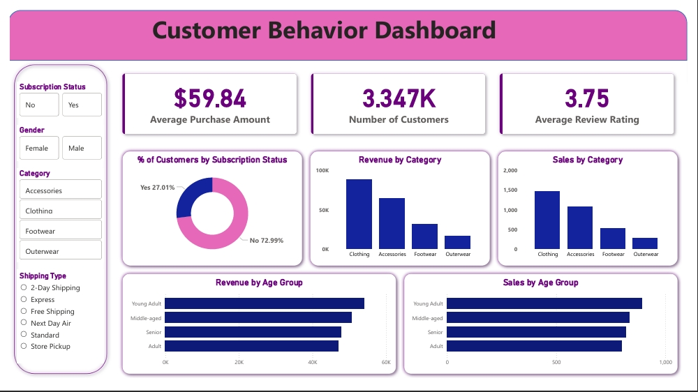

# 🛒 Customer Shopping Behavior Analysis

## 📌 Project Overview
This project analyzes customer shopping behavior using transactional data from retail purchases across various product categories. The primary goal is to uncover insights into spending patterns, customer segments, product preferences, and subscription behavior to guide strategic business decisions. 

## 🔄 Project Workflow
The project follows a structured data pipeline, moving from raw data to actionable business insights:


## 🛠️ Tools & Technologies
* **Python (Pandas):** Data cleaning, preprocessing, and Exploratory Data Analysis (EDA).
* **PostgreSQL:** Data storage and structured, transaction-based querying.
* **Power BI:** Building interactive dashboards for metric visualization.
* **Gamma AI:** Compiling the final project report and stakeholder presentation.

## 📂 Dataset Summary
* **Total Features:** 18 columns (Customer Demographics, Purchase Details, Shopping Behavior).
* **Demographics:** Age, Gender, Location, Subscription Status.
* **Transactions:** Item Purchased, Category, Purchase Amount, Season.
* **Behavior Metrics:** Discount Applied, Frequency of Purchases, Review Rating, Shipping Type.

---

## 🚀 Methodology

### Phase 1: Data Modeling & EDA (Python)
The data preparation phase involved ensuring data quality and creating useful metrics:
* **Missing Data Handling:** Imputed missing values in the `Review Rating` column using the median rating of each product category.
* **Standardization:** Renamed columns to `snake_case` to ensure seamless integration with the SQL database.
* **Feature Engineering:** Created an `age_group` column by binning customer ages and generated a `purchase_frequency_days` metric.

### Phase 2: Data Analysis (SQL)
The cleaned DataFrame was loaded into PostgreSQL to extract key business metrics:
* **Customer Segmentation:** Classified users into segments (Loyal, Returning, New) based on purchase history.
* **Revenue Drivers:** Identified that Male customers and the "Young Adult" age group generated the highest total revenue.
* **Subscription Impact:** Analyzed the divide between subscribers and non-subscribers, finding non-subscribers generated the vast majority of total revenue due to sheer volume, though individual average spends were nearly identical.
* **Product Trends:** Identified the top-rated items (Gloves, Sandals, Boots) and items heavily reliant on discounts (Hats, Sneakers).

### Phase 3: Interactive Dashboard (Power BI)
Connected the SQL database to Power BI to create a dynamic, highly visual dashboard for stakeholder monitoring.



**Key Dashboard KPIs:**
* **Total Customers:** ~3.3K
* **Average Purchase Amount:** $59.84
* **Average Review Rating:** 3.75
* **Subscriber Ratio:** 73% Non-Subscribers vs. 27% Subscribers.

### Phase 4: Stakeholder Presentation (Gamma AI)
Summarized the findings from Python, SQL, and Power BI into a cohesive project report. Used Gamma AI to generate a polished presentation for stakeholders, translating raw data into clear business strategies.

---

## 💡 Strategic Business Recommendations
Based on the data insights, the following actions are recommended:
1.  **Boost Subscriptions:** With 73% of the customer base unsubscribed, there is massive potential to promote exclusive benefits and convert one-time buyers into subscribers. 
2.  **Customer Loyalty Programs:** Implement targeted rewards for repeat buyers to confidently move them into the "Loyal" segment.
3.  **Review Discount Policy:** Re-evaluate discount strategies on highly dependent items (like Hats and Sneakers) to protect profit margins while maintaining sales volume.
4.  **Targeted Marketing:** Focus marketing ad spend on high-revenue demographics, specifically Young Adults and Male shoppers.

---

## 💻 How to Run This Project

1. **Clone Repository**
   ```bash
   git clone https://github.com/MVivekananda/customer-shopping-behavior-analysis-sql-powerbi.git
   cd customer-shopping-behavior-analysis-sql-powerbi
   ```

2. **Set Up Python Environment**
   ```bash
   python -m venv venv
   source venv/bin/activate  # On Windows: venv\Scripts\activate
   pip install pandas numpy matplotlib seaborn jupyter
   ```

3. **Set Up Database**
   - Create database in SQL
   - Run `customer_behavior.sql` to create tables
   - Import `customer_shopping_behavior.csv`

4. **Open Power BI Dashboard**
   - Open `customer_behavior_dashboard.pbix` in Power BI Desktop
   - Configure data connections
   - Refresh data source

5. **Run Jupyter Notebook** (Optional)
   ```bash
   jupyter notebook Customer_Shopping_Behavior_Analysis.ipynb
   ```

---

## 📝 Future Enhancements

- [ ] Machine learning for churn prediction
- [ ] Customer lifetime value forecasting
- [ ] Real-time data pipeline
- [ ] Mobile Power BI reports
- [ ] Automated email insights
- [ ] A/B testing framework

---
